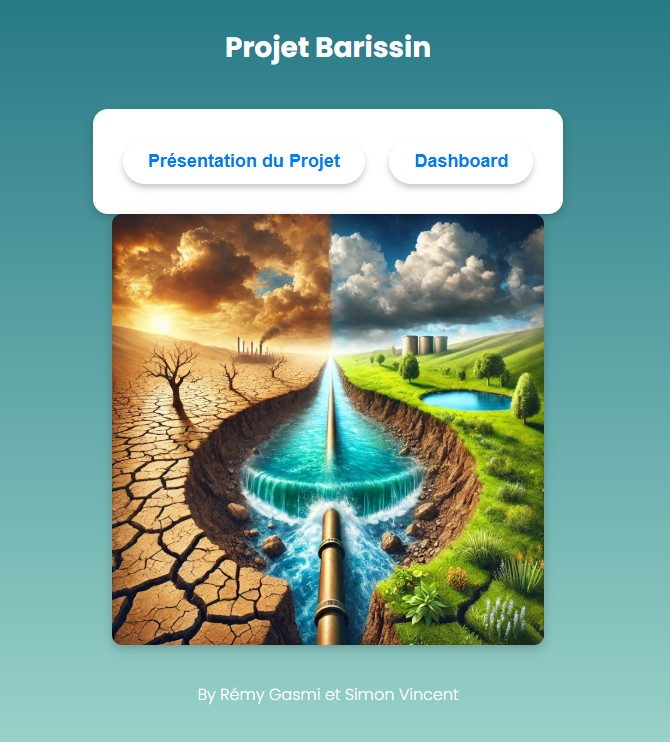
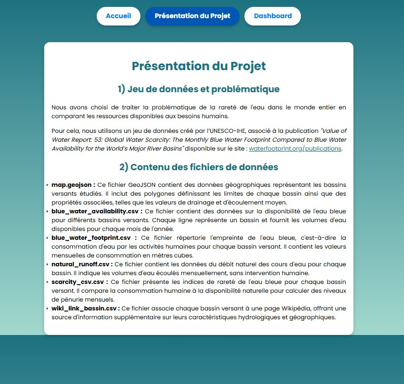
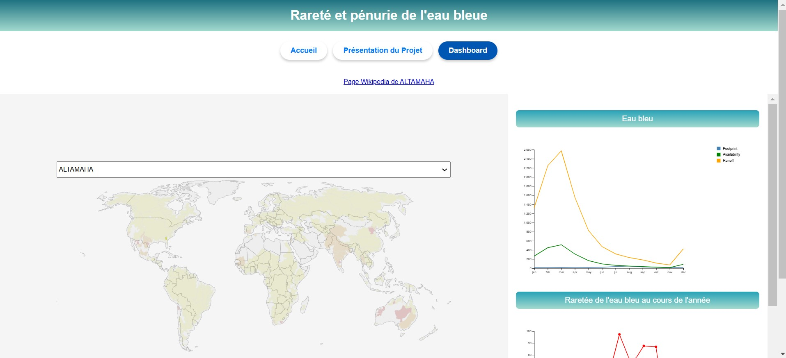

# Projet de Visualisation 

#### By [Rémy Gasmi](https://github.com/Mastocodeur) et [Simon Vincent](https://github.com/Emdotjy)
___

## Introduction

Ce dépôt est le fruit de notre travail dans le cadre de notre cours [**Visualisation interactive de données**](https://gitlab.ec-lyon.fr/rvuillem/visu).

Le thème cette année est sur l'eau. 

Il a fallu dans un premier temps trouvé un jeu de données, puis dans un second temps proposer une visualisation de ce jeu de données. 

## Les outils

Pour réaliser ce projet et pouvoir le partager nous avons utilisé les outils suivant : 

- Observable (https://observablehq.com/)
- Live Server
- Github Pages

### Live Server

Super outil de VSCode qui nous a permis de visualiser en direct notre site avant de le push sur github.

Avec un simple clic droit sur le code html, puis en cliquant sur "Open with Live Server" il est possible de visualiser notre travail localement.

## Notre visualisation

Vous pouvez accéder à notre visualisation en cliquant sur ce lien : https://mastocodeur.github.io/projet_visu.github.io/

Notre site contient 3 pages :
- Une page d'acceuil
- Une page de présentation du projet
- Une page dashboard contenant la visualisation du jeu de données

Voici ce que vous devriez normalement voir : 

La page d'acceuil : 

La page de présentation du projet :

La page de visualisation : 

## Sources 

Provenance de notre jeu de données : 
- https://mrb.grdc.bafg.de/
- https://www.waterfootprint.org/resources/Report53-GlobalBlueWaterScarcity.pdf
- https://www.kaggle.com/datasets/mpwolke/cusersmarildownloadsscarcitycsv
- https://www.waterfootprint.org/publications/

Pour apprendre à utiliser Github Pages : 
- https://www.youtube.com/watch?v=n12fzB6OOO4

